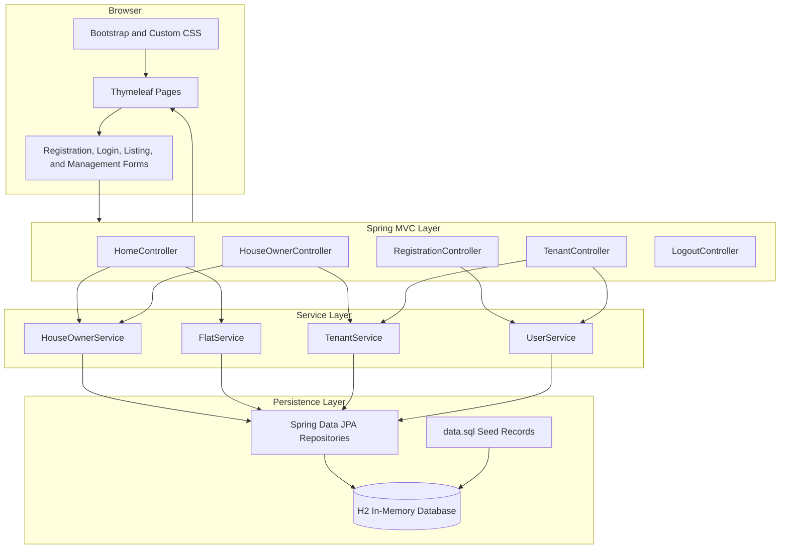
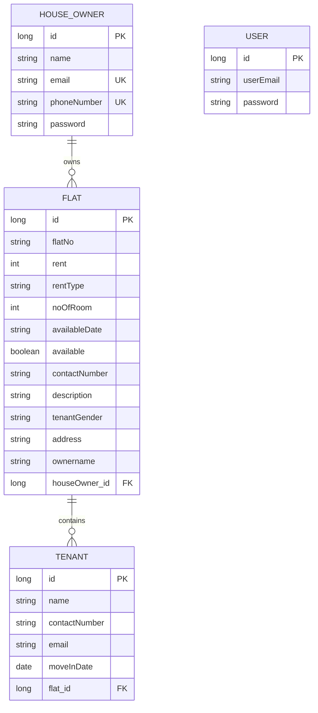
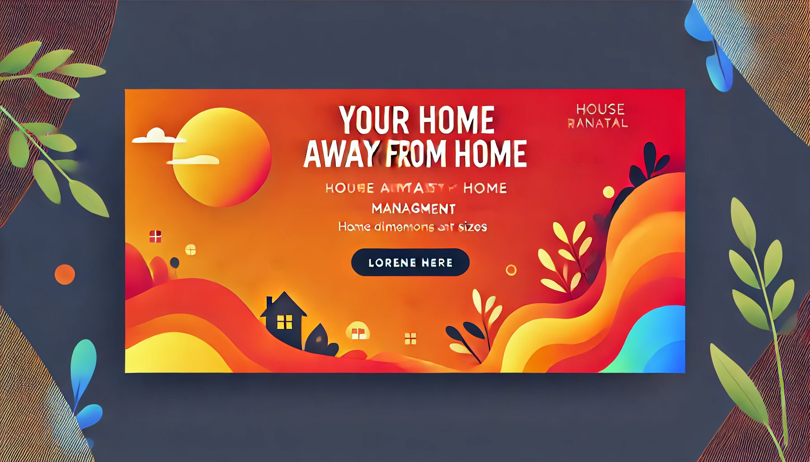

# StaySquare: Student Accommodation Listing Prototype

> A Spring Boot and Thymeleaf application for browsing student-oriented rental listings and managing owners, flats, and tenants.

[](https://openjdk.org/)
[](https://spring.io/projects/spring-boot)
[](https://www.thymeleaf.org/)
[](https://www.h2database.com/)


## Overview

StaySquare is a course-scale server-rendered web application for student accommodation listings. It models house owners, rental flats, tenant profiles, and basic user accounts through Spring Boot, Spring MVC, Spring Data JPA, Thymeleaf, Bean Validation, and an in-memory H2 database.

Visitors can browse all listings, open listing details, and view dedicated short-term and female-oriented listing sections. The repository also contains prototype workflows for owner registration, tenant registration, flat creation, tenant assignment, and tenant removal.

> **Current status:** The project is an educational CRUD and database prototype. Its current authentication and authorization implementation is unsafe and must be replaced before public deployment or use with real personal information.

---

## Implemented Scope

| Area | Capability | Status |
|---|---|---|
| Public browsing | List all flats | Implemented |
| Listing details | View rent, type, rooms, date, gender preference, address, and description | Implemented |
| Short-term listings | Filter by `rentType = Short` | Implemented |
| Female listings | Filter by `tenantGender = Female` | Implemented |
| Owner records | Registration and persistence | Implemented, passwords unsafe |
| Tenant-user records | Registration workflow | Partially implemented |
| Flat management | Add flats and inspect assigned tenants | Implemented as prototype |
| Tenant assignment | Associate tenants with flats | Implemented as prototype |
| Tenant deletion | Delete by tenant ID | Implemented, unauthorized GET route |
| DIU email validation | Custom `@diu.edu.bd` validator for tenant records | Implemented |
| UI templates | Thymeleaf pages, fragments, Bootstrap styling | Implemented |
| Persistent production data | External database | Not implemented |
| Seat-level inventory | Individual seats and occupancy | Not modeled |
| Roommate matching | Compatibility profiles and matching algorithm | Not implemented |
| Secure authentication | Per-user sessions or Spring Security | Not implemented |
| Automated testing | Application-context smoke test only | Minimal |

---

## System Architecture



### Request Flow

```text
Browser request
    |
    v
Spring MVC controller
    |
    v
Service method
    |
    v
Spring Data JPA repository
    |
    v
H2 database
    |
    v
Thymeleaf model and rendered HTML response
```

---

## Domain Model



`User` currently exists as a separate tenant-login record rather than a unified identity relationship with `Tenant`. A production redesign should use one account entity with roles and optional owner/tenant profiles.

---

## Route Summary

### Public Listing Routes

| Method | Route | Purpose |
|---|---|---|
| `GET` | `/` | Home page |
| `GET` | `/flatlist` | Display all flat listings |
| `GET` | `/short` | Display short-term listings |
| `GET` | `/female` | Display female-oriented listings |
| `GET` | `/{id}/detail` | Display a listing's details |

### Prototype Account and Management Routes

| Method | Route | Purpose | Security status |
|---|---|---|---|
| `GET/POST` | `/houseowner/registration` | Register an owner | Public, plaintext password storage |
| `GET/POST` | `/tenant/registration` | Register a user record | Logic is incomplete |
| `GET/POST` | `/houseowner` | Owner login/dashboard | Global Boolean state, unsafe |
| `GET/POST` | `/tenant` | Tenant login/dashboard | Global Boolean state, unsafe |
| `GET/POST` | `/houseowner/addFlat` | Create a flat | No reliable authorization |
| `GET/POST` | `/houseowner/addtenant` | Assign a tenant | No reliable authorization |
| `GET` | `/tenant/delete/{tenantId}` | Delete a tenant | Unsafe modifying GET request |
| `GET` | `/logout` | Reset global login flags | Not user-specific |

---

## Student-Oriented Listing Features

The current data model supports:

- full flat/room listings;
- rent categories such as family, bachelor, shared, studio, and short term;
- number of rooms;
- available date;
- availability status;
- gender preference;
- address and contact information; and
- descriptive listing details.

The project concept discusses seat-based accommodation and roommate matching, but those features are not represented in the current model or controllers. They should be presented as future scope rather than completed functionality.

---

## Interface Assets

The repository includes the following visual assets:

### Main StaySquare Banner


### Accommodation Images

| Listing image | Listing image |
|---|---|
|  |  |

These are interface assets, not screenshots demonstrating the complete workflow. Add verified screenshots after the authentication and build issues are corrected.

---

## Technology Stack

| Layer | Technologies |
|---|---|
| Language | Java 21 |
| Framework | Spring Boot 3.3.5 |
| Web layer | Spring MVC |
| Templates | Thymeleaf |
| Persistence | Spring Data JPA, Hibernate |
| Validation | Jakarta Bean Validation, custom constraint validator |
| Development database | H2 in-memory database |
| Optional runtime driver | MySQL Connector/J, currently unused |
| Frontend | HTML5, CSS3, Bootstrap, Font Awesome |
| Build | Maven |

The previous README stated Java 25, but `pom.xml` configures Java 21.

---


## Repository Structure

```text
Online-To-let-Project-Demo-/
|-- README.md
`-- onlineToletSystemDemo/
    `-- onlineToletSystemDemo/
        |-- pom.xml
        |-- mvnw
        |-- mvnw.cmd
        `-- src/
            |-- main/
            |   |-- java/com/otsdemo/onlineToletSystemDemo/
            |   |   |-- config/         # Commented JWT prototype
            |   |   |-- controller/     # Spring MVC controllers
            |   |   |-- model/          # JPA entities and validation
            |   |   |-- repository/     # Spring Data repositories
            |   |   `-- service/        # Application service methods
            |   `-- resources/
            |       |-- static/          # CSS and image assets
            |       |-- templates/       # Thymeleaf pages and fragments
            |       |-- application.properties
            |       `-- data.sql         # Demonstration seed data
            `-- test/                    # Context-loading test
```

This tree uses ASCII characters to avoid GitHub encoding problems.

---

## Local Setup

### Prerequisites

- Java 21
- Maven 3.9 or newer
- Git

### 1. Clone and Enter the Application

```bash
git clone https://github.com/anushka06onu/Online-To-let-Project-Demo-.git
cd Online-To-let-Project-Demo-/onlineToletSystemDemo/onlineToletSystemDemo
```

### 2. Run with Maven

```bash
mvn spring-boot:run
```

Then open:

```text
http://localhost:8081
```

### Maven Wrapper Status

The repository includes `mvnw` and `mvnw.cmd`, but the required `.mvn/wrapper/` configuration is missing. The wrapper therefore cannot currently bootstrap Maven. Either:

- install Maven locally and use `mvn`; or
- regenerate and commit the complete Maven Wrapper files.

### Development Data

The application uses an H2 in-memory database and loads fictional seed listings from `src/main/resources/data.sql`. All runtime changes disappear after restart.

---

## Recommended Improvements

### Immediate Security Repairs

- [ ] Add Spring Security.
- [ ] Use BCrypt or Argon2 password hashing.
- [ ] Replace global Boolean login state with secure per-user sessions.
- [ ] Verify email and password against the same account.
- [ ] Add owner and tenant roles.
- [ ] Enforce record ownership on every management route.
- [ ] Change deletion to authenticated `POST` or `DELETE` with CSRF protection.
- [ ] Remove hardcoded demonstration credentials from production configuration.

### Domain and Product Design

- [ ] Create a unified `Account` entity with role-based profiles.
- [ ] Model buildings, flats, rooms, beds/seats, and occupancy separately.
- [ ] Add listing images and availability history.
- [ ] Implement real search by area, budget, availability, gender preference, and rent period.
- [ ] Implement seat-level booking requests.
- [ ] Design roommate preferences and a transparent matching score.
- [ ] Add moderation, reporting, listing verification, and contact privacy.

### Engineering Quality

- [ ] Replace field injection with constructor injection.
- [ ] Add DTOs instead of binding entities directly to forms.
- [ ] Add service-level transactions for multi-record operations.
- [ ] Replace date strings with `LocalDate`.
- [ ] Add database migrations through Flyway or Liquibase.
- [ ] Create separate development and production profiles.
- [ ] Add controller, service, repository, validation, and authorization tests.
- [ ] Restore the complete Maven Wrapper.
- [ ] Add CI for build and test verification.

### Documentation

- [ ] Add real application screenshots.
- [ ] Add a tested route/feature matrix.
- [ ] Document fictional demonstration accounts only after secure hashing is implemented.
- [ ] Add deployment configuration after switching to persistent storage.

---

## Intended Use

StaySquare is suitable as:

- a Spring Boot learning project;
- a JPA entity-relationship demonstration;
- a Thymeleaf server-rendered application;
- a Bean Validation example; and
- a student-housing product concept prototype.

It is not ready for real housing transactions, production authentication, or storage of personal information.

---

## What This Project Demonstrates

- Spring MVC controllers and Thymeleaf rendering.
- JPA entity relationships.
- Repository and service layers.
- Custom Jakarta Bean Validation.
- Filtered listing queries.
- Reusable HTML fragments and responsive styling.
- H2 database seeding for demonstration.
- Recognition of the security and domain-model work required for production housing software.

---

## Author

Developed by **Fateha Hossain Anushka**
